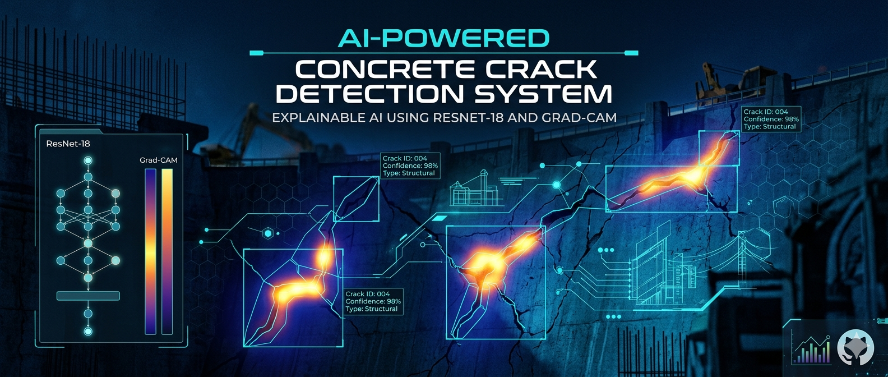

# 🚧 AI-Powered Concrete Crack Detection System with Explainable AI

## 🧠 Deep Learning + Computer Vision for Smart Infrastructure Inspection

<p align="center">
  
</p>

<p align="center">
  
  
  
  
</p>

---

## 📊 Performance Highlights

| Metric | Value |
|---|---|
| Accuracy | 95.7% |
| Model | ResNet-18 |
| Explainability | Grad-CAM |
| Application | Infrastructure Inspection |

---

## 📌 Project Overview

Traditional infrastructure crack inspection is time-consuming and labor-intensive. This project automates crack detection using deep learning and explainable AI techniques to improve inspection efficiency and reliability in real-world environments.

This project introduces an **AI-powered automated crack detection system** capable of detecting cracks in concrete surfaces using:

✅ Deep Learning  
✅ Computer Vision  
✅ Explainable AI (Grad-CAM)  

The system uses a fine-tuned **ResNet-18 Convolutional Neural Network (CNN)** to classify concrete surface images into:

✔️ Crack  
✔️ No Crack  

Additionally, the project integrates **Grad-CAM Explainable AI visualization** to highlight the regions responsible for predictions, improving model transparency and engineering trust.

---

# 🌟 Key Features

<div align="center">

| Feature | Description |
|---|---|
| ✅ 95.7% Accuracy | High-performance crack classification |
| 🧠 Explainable AI | Grad-CAM visualization |
| ⚡ Automated Inspection | Faster infrastructure assessment |
| 🔍 Crack Localization | Highlights crack regions visually |
| 📈 Scalable Pipeline | Suitable for large-scale deployment |
| 🌐 Flask Web Interface | Interactive AI inspection system |
| 🏗️ Industry-Oriented | Infrastructure inspection focused |

</div>

---

# 🖼️ System Demonstration

<p align="center">
  
</p>

---

# 🧠 Solution Workflow

<div align="center">

```text
Concrete Surface Image
            ↓
     Image Preprocessing
            ↓
    ResNet-18 Classification
            ↓
      Crack Prediction
            ↓
     Grad-CAM Explainability
            ↓
   Crack Region Visualization
            ↓
       Final Prediction Output
```

</div>

---

# 🔬 Deep Learning Model

<div align="center">

| Component | Details |
|---|---|
| Model Architecture | ResNet-18 |
| Framework | PyTorch |
| Task | Binary Classification |
| Classes | Crack / No Crack |
| Explainability | Grad-CAM |
| Domain | Infrastructure Inspection |

</div>

---

# 📊 Model Performance

<div align="center">

| Metric | Score |
|---|---|
| Accuracy | 95.70% |
| Precision | 95.10% |
| Recall | 96.20% |
| F1-Score | 95.60% |
| AUC Score | 0.974 |
| Classification | Crack / No Crack |

</div>

---

# 📌 Confusion Matrix Analysis

The confusion matrix demonstrates strong classification capability with:

✔️ High True Positive Rate  
✔️ Strong Non-Crack Classification  
✔️ Low False Positives  
✔️ Balanced Prediction Performance  

<p align="center">
  
</p>

---

# 📈 ROC Curve & AUC Analysis

The ROC Curve demonstrates the discriminative capability of the ResNet-18 model.

### Key Achievements:
- AUC Score: **0.974**
- Excellent crack vs non-crack separability
- Strong sensitivity and specificity balance

<p align="center">
  
</p>

---

# 🧠 Explainable AI using Grad-CAM

Unlike traditional black-box AI systems, this project integrates **Grad-CAM Explainable AI** to visually interpret model predictions.

## 🔍 Benefits

✅ Highlights crack-affected regions  
✅ Improves model transparency  
✅ Assists engineers during validation  
✅ Enhances trustworthiness of predictions  
✅ Supports interpretable infrastructure AI systems  

---

# 🏗️ Crack Detection Results

## ✅ Crack Prediction
The model successfully:

- Detected visible cracks accurately
- Localized crack regions effectively
- Highlighted damaged areas visually
- Identified multiple crack patterns

---

## ✅ Non-Crack Prediction
The system correctly:

- Classified normal concrete surfaces
- Reduced unnecessary false alarms
- Improved deployment reliability

---

# 💼 Real-World Operational Impact

The following estimates were derived based on industry-level deployment discussions and evaluation scenarios.

<div align="center">

| Operational Area | Improvement |
|---|---|
| Inspection Time | 25–30 Days → 3–5 Days |
| Workforce Requirement | 3–5 Inspectors → 1–2 Technicians |
| Operational Cost Reduction | ~72% |
| Estimated Savings | ~₹9 Lakhs per Site |
| Estimated ROI | ~270% |

</div>

> 📌 These values represent estimated deployment projections and may vary depending on infrastructure scale and inspection conditions.

---

# 📁 Dataset Information

## 📌 Dataset Type
Concrete Surface Crack Image Dataset

## 📌 Classes
- Crack
- No Crack

## 📌 Preprocessing Techniques
- Image Resizing
- Normalization
- Data Augmentation
- Tensor Conversion
- Noise Reduction

---

# 🛠️ Technology Stack

<div align="center">

| Category | Technologies |
|---|---|
| 💻 Programming | Python |
| 🧠 Deep Learning | PyTorch |
| 👁️ Computer Vision | OpenCV |
| 🌐 Web Framework | Flask |
| 📊 Visualization | Matplotlib |
| 🔍 Explainability | Grad-CAM |

</div>

---

# 🧠 Concepts Used

- Deep Learning
- Computer Vision
- Explainable AI
- Transfer Learning
- CNN Architectures
- Image Classification
- Infrastructure AI

---

# 📂 Project Structure

```bash
AI-Powered-Concrete-Crack-Detection/
│
├── dataset/
├── models/
├── crack_outputs/
├── static/
├── templates/
├── images/
│   ├── project_overview.png
│   ├── confusion_matrix.png
│   └── roc_curve_analysis.png
│
├── app.py
├── crack_detection.ipynb
├── model.pth
├── requirements.txt
└── README.md
```

---

# ⚙️ Installation & Setup

## 1️⃣ Clone Repository

```bash
git clone https://github.com/Janicebenita/AI-Powered-Concrete-Crack-Detection-System-with-Explainable-AI-Grad-CAM-.git
```

---

## 2️⃣ Navigate to Project Directory

```bash
cd AI-Powered-Concrete-Crack-Detection-System-with-Explainable-AI-Grad-CAM-
```

---

## 3️⃣ Install Dependencies

```bash
pip install -r requirements.txt
```

---

## 4️⃣ Run Application

```bash
python app.py
```

---

# 🌐 Open in Browser

```text
http://127.0.0.1:5000
```

---

# 🔮 Future Enhancements

- 🎥 Real-Time Video Crack Detection
- 🚁 Drone-Based Inspection
- 📱 Mobile Deployment
- ⚡ Edge AI Optimization
- ☁️ Cloud Deployment
- 📊 Multi-Class Crack Severity Analysis

---

# 📜 License & Acknowledgement

This project was developed for educational, research, and industry-oriented learning purposes under the guidance and support of:

<div align="center">

# 🏢 M/s Larsen & Toubro – Divisional Corporate

</div>

The project focuses on:

- AI-based Infrastructure Inspection
- Deep Learning Applications
- Computer Vision Solutions
- Explainable AI for Engineering Systems

Special thanks to **M/s Larsen & Toubro – Divisional Corporate** for their valuable technical guidance, domain insights, and mentorship throughout the project development process.

---

## 📌 Usage Notice

This repository is intended for:

- Educational Purposes
- Research & Learning
- Portfolio Demonstration
- Non-commercial AI Exploration

Unauthorized commercial redistribution or misuse of project assets or proprietary insights is discouraged.

---

# ⭐ Project Highlights

✅ Real-world infrastructure AI application  
✅ Explainable AI integration  
✅ Industry-oriented computer vision solution  
✅ High-performance deep learning model  
✅ Scalable and interpretable AI pipeline  
✅ Deployment-focused architecture  

---

# 👩‍💻 Author

<div align="center">

# Janice Benita F

### AI • Machine Learning • Computer Vision Enthusiast

🎓 B.Tech – Information Technology (2023–2027)

📧 janicebenita123@gmail.com

🔗 GitHub  
https://github.com/Janicebenita

🔗 LinkedIn  
https://linkedin.com/in/janice13

</div>

---

# 🤝 Contributions

Contributions, feedback, and suggestions are welcome!

## Steps:
1️⃣ Fork the repository  
2️⃣ Create a feature branch  
3️⃣ Commit your changes  
4️⃣ Push to GitHub  
5️⃣ Open a Pull Request  

---

# ⭐ Support This Project

If you found this project useful:

⭐ Star the repository  
🍴 Fork the project  
💡 Share your feedback  
🚀 Contribute improvements  

---

<div align="center">

# 🏗️ Building Smarter Infrastructure Inspection using AI

### Powered by Deep Learning & Explainable AI

⭐ Star This Repository If You Like The Project ⭐

</div>
